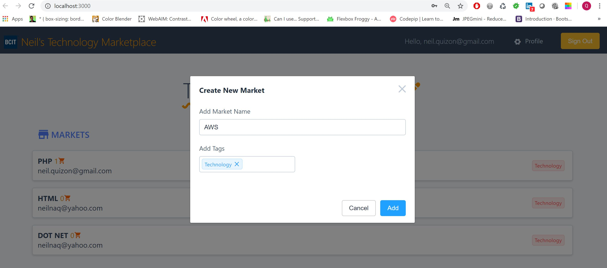

# A Serverless Technology Marketplace app built with React / Amplify using GraphQL API, Multi-Factor Authentication, and Lambda

## Details:
### * Created entire GraphQL APIs from the command line using Amplify CLI
### * Built serverless GraphQL APIs with AWS Appsync
### * Multi-Factor Authentication and Verification Codes using AWS Cognito
### * Created serverless REST APIs (functions) with AWS Lambda that run entirely in the cloud
### * Image and file uploads with AWS S3 Storage
### * Customized Amplify's built-in React Components
### * Storing and managing app data with a DynamoDB database
### * Verifying user emails with email confirmations
### * Worked with AWS Console

### Screenshots:
 
 
 
 
 

          
